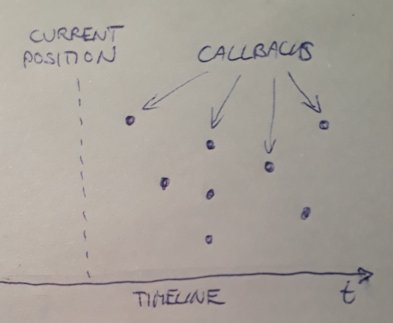

# omkamra.sequencer

[](https://clojars.org/com.github.omkamra/sequencer)

A Clojure library for sequencing events on a timeline.

## Timeline



A *timeline* is a Clojure map which associates points in time
(*positions*) with vectors of *callbacks*.

A callback (in this context) is a Clojure function with zero
arguments.

As the sequencer is running, the *current position* advances through
time. When we reach a position which has callbacks associated with it,
the sequencer executes every callback in the associated vector.

The current position is incremented in *ticks*.

One tick is a predefined subdivision of a *beat*. With the default
configuration, there are 96 ticks per beat and 120 beats per minute.

## Patterns

A *pattern* consists of four things:

1. `events`: a vector of `[offset callback]` pairs
2. `snap`: an alignment value expressed in ticks
3. `delay`: a delay value expressed in ticks
4. `offset`: the current offset of the pattern (only used while the pattern is built)

An *offset* is a position relative to the beginning of the pattern.

A pattern can be *merged* into the timeline at the current
position. The merge operation adds the offset of each event plus the
pattern delay to the current position of the timeline and injects the
callbacks at the resulting absolute positions.

If `snap` is non-zero, the merge operation rounds up the current
position of the timeline to the next multiple of `snap` and uses this
position as the base when converting event offsets into absolute
positions.

## Pattern transformers

A *pattern transformer* is a function that transforms one pattern into another.

It has two arguments:

1. the pattern to be transformed
2. a map of *bindings*

Bindings are key-value pairs that can influence the operation of the
pattern transformer.

## Pattern expressions

A *pattern expression* is a data structure (a Clojure vector) which
describes a pattern transformer. The type of the pattern transformer
is identified by a keyword at the head of the vector. A pattern
expression can be *compiled* into the corresponding pattern
transformer via `(sequencer/compile-pattern-expr)`.

### :nop

Example: `[:nop]`

This is the identity transformer: it returns the pattern which was
given to it.

### :clear

Example: `[:clear]`

Returns an empty seed pattern:

```
{:events []
 :snap 0
 :delay 0
 :offset 0}
```

### :call

Example: `[:call (fn [] (println "action!"))]`

Pairs the current offset of the input pattern and the single argument
(which must be a function) into an event and adds it to the `events`
vector of the pattern.

### :snap

Example: `[:snap 4]`

Sets the `snap` field of the pattern to the given number of beats
(converted into ticks).

### :delay

Example `[:delay 1]`

Sets the `delay` field of the pattern to the given number of ticks.

### :wait

Example: `[:wait 1]`

1. If the argument N is a positive number, adds N steps to the pattern offset
2. If the argument N is a negative number, advances the pattern offset
   until it reaches the next multiple of -N steps

A *step* is a unit of duration expressed in beats.

The current step value is taken from the bindings (default: 1).

### :bind

Example: `[:seq [:bind {:step 2} [:wait 1]] [:bind {:step 3} [:wait 1]]]`

Updates input bindings as described by the first map argument, then
threads the input pattern through the given pattern transformers.

Each pattern transformer gets the updated bindings.

In the above example, the `[:wait 1]` pattern will wait 2 beats in the
first bind and 3 beats in the second.

Binding values are not limited to constants, they can also be *bind
expressions*:

- `[:add N]`: adds N to the current binding value
- `[:sub N]`: subtracts N from the current binding value
- `[:mul N]`: multiplies the current binding value by N
- `[:div N]`: divides the current binding value by N

### :var

Examples:

- `[:var #'v]`
- `[:var #'f 5]`

Fetches the current binding of the var given in the first argument. If
this value is a pattern transformer, applies it to the input pattern
and bindings.

Otherwise it tries to convert the value into a pattern form. First it
checks if the value is a Clojure function. If it is, applies it to the
rest of the arguments inside the `:var` form and uses the return value
as the pattern form. Otherwise uses the value as it is.

Finally it wraps the pattern form in a `:bind` expression - using the
input bindings as its bind map -, compiles this `:bind` expression
into a pattern transformer and applies the result to the input pattern
and bindings.

The `:var` transformer can be used to support live coding.

### :seq

Example: `[:seq [:wait 2] [:call f] [:wait 3] [:call g]]`

Threads the input pattern through the given pattern transformers.

Each pattern transformer gets the same bindings.

### :mix

Example: `[:mix [:call f] [[:wait 2] [:call g]] [:call h]]`

Threads the input pattern through the given pattern
transformers. Resets the pattern offset to its original value after
each step.

This can be used to mix several patterns on top of each other.

### :mix1

Example: `[:mix1 [:call f] [[:wait 2] [:call g]] [:call h]]`

Same as `[:seq [:mix [[:wait 2] [:call g]] [:call h]] [:call f]]`

In other words, the first child form advances the offset but the others don't.

### :play

Example: `[:play [:wait 8] [:var #'ornament]]`

At compile-time, wraps the supplied patterns in a `:seq` and compiles
the result.

At build-time, adds an event to the input pattern which builds a new
pattern using the previously compiled transformer and the input
bindings, then merges the resulting pattern onto the timeline.

### :bpm

Example: `[:bpm 180]`

Adds an event that changes the sequencer's BPM to the given value.

## Syntactic sugar

### Pattern forms

A *pattern form* is a Clojure value that can be translated into a
pattern expression and then compiled into a pattern transformer.

By this definition the set of pattern forms includes all pattern
expressions.

In addition, Clojure values matching the following predicates are
automatically recognized as pattern forms and converted into the
corresponding pattern expressions:

| Clojure predicate  | Pattern expression |
| ------------------ | ----------------   |
| `var?`             | `[:var ...]`       |
| `fn?`              | `[:call ...]`      |
| `sequential?`      | `[:seq ...]`       |
| `set?`             | `[:mix ...]`       |
| `nil?`             | `[:nop]`           |

### Hoisting of bind maps

The following form:

```
[:bind {:step 2}
  [:seq A B C]]
```

can be also written like this:

```
[:seq {:step 2} A B C]
```

Any maps found inside the `[:seq ...]` form are picked out, merged
together left to right and then used as the bind map of an enclosing
`:bind` form.

This also works for `:mix` and `:mix1`.

## Targets

A *target* can extend the vocabulary of pattern forms and may also
provide access to various software or hardware devices which can
execute these new forms in specific contexts.

For example, the
[fluidsynth](https://github.com/omkamra/sequencer-fluidsynth) target
manages a SoundFont MIDI synthesizer and provides forms like
`[:channel N]` to change the current MIDI channel, `[:program N]` to
select a synthesizer patch and `[:note N]` to trigger a MIDI note.

Targets implement the following protocol:

- `(start t)`: start any devices associated with the target (e.g. an audio engine)
- `(stop t)`: stop the associated devices
- `(restart t)`: stop + start
- `(get-default-bindings t)`: return target-specific default bindings
- `(resolve-binding t k v)`: resolve a binding using target-specific logic
- `(compile-pattern-expr t pattern)`: extend the set of pattern expressions
- `(compile-pattern-form t form)`: extend the set of pattern forms
- `(compile-bind-expr t key expr)`: extend the set of bind expressions

To develop a new target, you need to implement the `Target` and
`TargetFactory` protocols, then register the object which implements
`TargetFactory` with the sequencer
(`sequencer/register-target-factory`).

A target factory implements three methods:

- `(understands-descriptor? tf descriptor)`: returns `true` if the
  target factory can interpret the passed target descriptor
- `(sanitize-descriptor tf descriptor)`: converts the target
  descriptor into canonical form
- `(make-target tf descriptor)`: creates the actual target based on
  information in the descriptor

To use a target, you must first instantiate it with
`(sequencer/make-target descriptor)`, where `descriptor` is a data
structure that describes the attributes of the desired target. The
returned target shall be registered with the sequencer library
(`sequencer/register-target`).

Once the target has been registered, you can bind it to the special
`:target` key inside a bind form: this lets every pattern within the
scope of that binding use the target's extensions.

Besides binding targets by value, you can also use *target
aliases*. For this to work, you must pass two arguments to
`sequencer/register-target`: the target itself and its alias. The
alias must be a namespace-qualified keyword. Once a target has been
registered with an alias, you can bind this alias to the `:target` key
inside bind maps and it will be automatically resolved to the right
target.

## General usage

### Create a sequencer object

```
(require '[omkamra.sequencer :as sequencer])

(def s (sequencer/create {:bpm 145 :tpb 24}))
```

The config map is optional:

```
(def s (sequencer/create))
```

In this case `:bpm` will default to 120 and `:tpb` to 96.

### Play a pattern

```
(sequencer/play s [:seq [:wait 1] #(println "Hello, world!")])
```

This would start the sequencer and any previously registered targets
(if they have not been started yet), compile the supplied pattern
form, call the resulting pattern transformer with a seed pattern and
initial bindings, then merge the resulting pattern into the timeline.

Seed pattern:

```
{:events []
 :snap 0
 :delay 0
 :offset 0}
```

Initial bindings (in case of the above example):

```
{:sequencer s
 :step 1}
```

You can inject your own bindings by passing them as the third argument
of `sequencer/play`.

### Clear the timeline

```
(sequencer/clear! s)
```

This can be used to stop any unwanted mayhem.

### Set the BPM of the sequencer

```
(sequencer/bpm! s 150)
```

### Get the status of the sequencer

```
(sequencer/status s)
```

### Start the sequencer and all registered targets

```
(sequencer/start s)
```

### Stop the sequencer and all registered targets

```
(sequencer/stop s)
```

### Restart the sequencer and all registered targets

```
(sequencer/restart s)
```

## License

Copyright © 2021 Balázs Ruzsa

This program and the accompanying materials are made available under the
terms of the Eclipse Public License 2.0 which is available at
http://www.eclipse.org/legal/epl-2.0.

This Source Code may also be made available under the following Secondary
Licenses when the conditions for such availability set forth in the Eclipse
Public License, v. 2.0 are satisfied: GNU General Public License as published by
the Free Software Foundation, either version 2 of the License, or (at your
option) any later version, with the GNU Classpath Exception which is available
at https://www.gnu.org/software/classpath/license.html.
